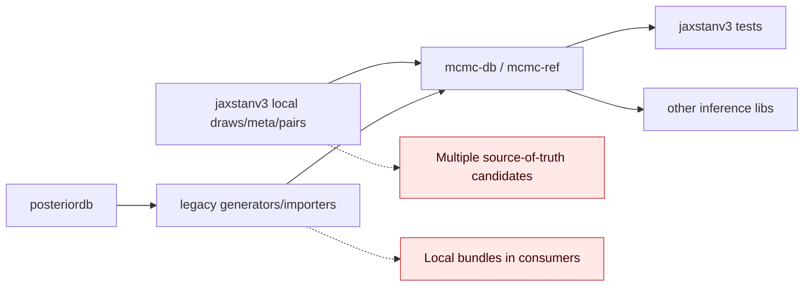
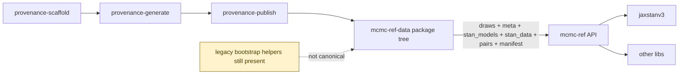

# v0.1.3 Integration Essay: From Bazaar to Waterworks

Imagine reference validation as a city water system.

Before this release, every neighborhood had its own hose setup.
`jaxstanv3` had local draw bundles, `mcmc-db` had multiple generation/import paths, and provenance could cross repos in both directions.
Water reached homes, but nobody wanted to audit every pipe when something tasted strange.

v0.1.3 is the first release where the city chose a single water plant:

- `provenance-scaffold`
- `provenance-generate`
- `provenance-publish`

That sequence is now the intended plant-to-house path.
The important intuition is not "we deleted code"; it is "we deleted competing truths."
For inference libraries, this matters more than convenience: validation is only as good as your confidence in where draws came from.

## Pre/Post Architecture

### Before (multi-source, reverse flows possible)



### After (implemented flow on `release/v0.1.3`)

```mermaid
flowchart LR
    S[provenance-scaffold] --> G[provenance-generate]
    G --> U[provenance-publish]
    U --> D[mcmc-ref-data package]
    D --> API[mcmc-ref DataStore/reference API]
    API --> JAX[jaxstanv3]
    API --> OTH[other inference libs]
    DEV[MCMC_REF_LOCAL_ROOT (dev-only override)] -.optional.-> API
```

### After Gap Closure (data-plane now complete)



## Strict Reality Check (remaining non-clean edges)

The specific data-plane gaps called out in PR #13 are now closed:

1. `pairs/**` is now present in package data.
2. `provenance_manifest.json` is now present in package data.
3. `dugongs` and `radon_pooled` now have packaged draws/meta/stan model/stan data.
4. Every packaged draw now has matching `meta`, `stan_models`, and `stan_data` entries.

What is still not maximally clean yet:

1. Non-canonical bootstrap/generation helpers still exist in the repo (`sync_*`, `generate_*` scripts around posteriordb/local generation).
2. Canonical path is clear, but those helpers can still create conceptual drift for new contributors.
