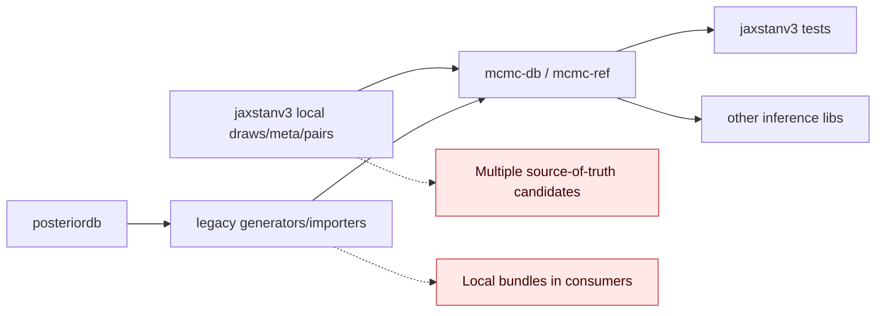

# v0.1.3 Integration Essay: From Bazaar to Waterworks

Imagine reference validation as a city water system.

Before this release, every neighborhood had its own hose setup.
`jaxstanv3` had local draw bundles, `mcmc-db` had multiple generation/import paths, and provenance could cross repos in both directions.
Water reached homes, but nobody wanted to audit every pipe when something tasted strange.

v0.1.3 is the first release where the city chose a single water plant:

- `provenance-scaffold`
- `provenance-generate`
- `provenance-publish`

That sequence is now the intended plant-to-house path.
The important intuition is not "we deleted code"; it is "we deleted competing truths."
For inference libraries, this matters more than convenience: validation is only as good as your confidence in where draws came from.

## Pre/Post Architecture

### Before (multi-source, reverse flows possible)



### After (intended canonical flow)

```mermaid
flowchart LR
    S[provenance-scaffold] --> G[provenance-generate]
    G --> U[provenance-publish]
    U --> D[mcmc-ref-data package]
    D --> API[mcmc-ref DataStore/reference API]
    API --> JAX[jaxstanv3]
    API --> OTH[other inference libs]
    DEV[MCMC_REF_LOCAL_ROOT (dev-only override)] -.optional.-> API
```

## Strict Reality Check (what is still not fully clean)

1. Package-only corpus is still incomplete for the "single source" story.
   - Current `packages/mcmc-ref-data/src/mcmc_ref_data/data` has no `pairs/` directory.
   - So package-only `DataStore` reports `pairs_count = 0`.
2. Issue #12 model completeness is not fully closed in packaged assets yet.
   - `dugongs` missing in packaged draws.
   - `radon_pooled` missing in packaged draws.
3. Packaged provenance surface is incomplete.
   - No `provenance_manifest.json` in package data tree yet.

So the code architecture is cleaner, but artifact publication is one step behind that architecture.
In practical terms: the control plane is modern; part of the data plane still needs a final publish refresh.

## What "done" looks like

- Publish refreshed `mcmc-ref-data` containing:
  - `draws/meta` for all curated models including `dugongs` and `radon_pooled`
  - `pairs/**`
  - `provenance_manifest.json`
- Then cut consumer repos (`jaxstanv3`, others) to package-only references with no checked-in local reference bundles.
